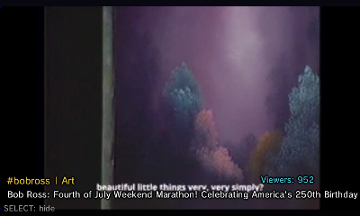
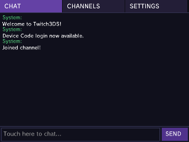
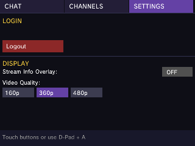
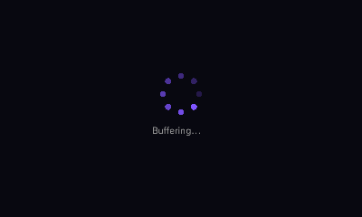

<div align="center">


# TwViewer

**Twitch viewer for New 3DS / New 2DS XL**

Unofficial client for Twitch streaming platform.

Live video (MVD hardware decode) • AAC audio • IRC chat

</div>

## Screenshots

| Top Screen | Chat | Settings | Buffering |
|------------|------|----------|-----------|
|  |  |  |  |

## Install via FBI QR Code

Open this page on your phone or PC, then scan the QR code with FBI on your 3DS
(FBI → Remote Install → Scan QR Code). Always points to the latest release.


Or enter the URL manually:

```
https://github.com/gamerboyrts-a11y/twviewer/releases/latest/download/twviewer.3dsx
```

Alternatively, download `twviewer.3dsx` from the
[latest release](https://github.com/gamerboyrts-a11y/twviewer/releases/latest)
and copy it to `sd:/3ds/` for the Homebrew Launcher.

**After installation:** find app at `sd:/3ds/twviewer.3dsx` — launch from Homebrew Launcher.

## Features

- Live stream video on the top screen (New 3DS MVD hardware H.264 decode)
- AAC audio playback (requires DSP firmware dump — run the DSP1 homebrew once)
- Twitch IRC chat (read + send)
- Device Code login (no password needed)
- Stream metadata overlay (title / game / viewers)
- Channel history
- New 3DS / New 2DS XL only (uses the MVD decoder and second CPU core)

## Credits

This project uses the following tools and libraries:

- **[devkitPro](https://devkitpro.org/)** — devkitARM toolchain for 3DS homebrew
- **[libctru](https://github.com/devkitPro/libctru)** — Nintendo 3DS userland library
- **[citro2d](https://github.com/devkitPro/citro2d) / [citro3d](https://github.com/devkitPro/citro3d)** — GPU rendering libraries
- **[FFmpeg](https://github.com/Core-2-Extreme/Video_player_for_3DS)** — prebuilt 3DS static libs from Core-2-Extreme's Video_player_for_3DS
- **[mbedTLS](https://github.com/Mbed-TLS/mbedtls)** — TLS/SSL library for IRC
- **[curl](https://curl.se/)** — HTTP client library
- **[stb_image](https://github.com/nothings/stb)** — single-header image loading library

## License

MIT License - free to use, modify, and distribute.

**Third-party components:**
- FFmpeg libraries: LGPL 2.1+ (prebuilt by [Core-2-Extreme](https://github.com/Core-2-Extreme/Video_player_for_3DS))
- mbedTLS: Apache License 2.0
- curl: MIT-style license
- stb_image: Public domain / MIT
- libctru, citro2d/3d: zlib License

## Disclaimer

TwViewer is an independent project and is not affiliated with, endorsed by, or sponsored by Twitch Interactive, Inc. "Twitch" is a trademark of Twitch Interactive, Inc.

## Donation

Support this project with a BTC donation if you'd like to help. I'd really appreciate any contribution. Thank you.

**BTC:** `bc1q4cjv0pkhws5mdwrugnuukskf5dl4yg3vx7xkms`
